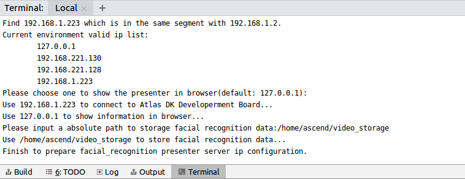

CN|[EN](Readme_en.md)

# 人脸识别<a name="ZH-CN_TOPIC_0208835545"></a>

开发者可以将本Application部署至Atlas 200 DK上实现人脸注册、并通过摄像头对视频中的人脸信息进行预测，与已注册的人脸进行比对，预测出最可能的用户。

## 前提条件<a name="zh-cn_topic_0203223340_section137245294533"></a>

部署此Sample前，需要准备好以下环境：

-   已完成Mind Studio的安装。
-   已完成Atlas 200 DK开发者板与Mind Studio的连接，交叉编译器的安装，SD卡的制作及基本信息的配置等。
## 部署
1. 部署，可以选择如下快速部署或者常规方法部署，二选一即可；

   1.1 快速部署，请参考：https://github.com/Atlas200DKTest/faster-deploy.git 。
    > **说明：**   
    >-   该快速部署脚本可以快速部署多个案例，请选择facialrecognition案例部署即可。 
    >-   该快速部署脚本自动完成了代码下载、模型转换、环境变量配置等流程，如果需要了解详细的部署过程请选择常规部署方式，请转1.2 常规部署。
    
   1.2 常规部署，请参考：https://github.com/Atlas200DKTest/sample-README/tree/master/sample-facialrecognition  。
    > **说明：**   
    >-   该部署方式，需要手动完成代码下载、模型转换、环境变量配置等过程。完成后，会对其中的过程会更加了解。


## 编译<a name="zh-cn_topic_0203223340_section147911829155918"></a>

1.  打开对应的工程。

    以Mind Studio安装用户在命令行中进入安装包解压后的“MindStudio-ubuntu/bin”目录，如：$HOME/MindStudio-ubuntu/bin。执行如下命令启动Mind Studio

    **./MindStudio.sh**

    启动成功后，打开**sample-facialrecognition**工程，如[图1](#zh-cn_topic_0203223340_fig28591855104218)所示。

    **图 1**  打开sample-facialrecognition工程<a name="zh-cn_topic_0203223340_fig28591855104218"></a>  
    

2.  在**src/param\_configure.conf**文件中配置相关工程信息。

    如[图2](#zh-cn_topic_0203223340_fig1338571124515)所示。

    **图 2**  配置文件路径<a name="zh-cn_topic_0203223340_fig1338571124515"></a>  
    

    

    该配置文件内容如下：

    ```
    remote_host=
    data_source=
    presenter_view_app_name=
    ```

    需要手动添加参数配置：

    -   remote\_host：配置为Atlas 200 DK开发者板的IP地址。
    -   data\_source: 配置为摄像头所属Channel，取值为Channel-1或者Channel-2，查询摄像头所属Channel的方法请参考[Atlas 200 DK使用指南](https://ascend.huawei.com/doc)中的“如何查看摄像头所属Channel”。
    -   presenter\_view\_app\_name: 用户自定义的在PresenterServer界面展示的View Name，此View Name需要在Presenter Server展示界面唯一，只能为大小写字母、数字、“\_”的组合，位数3\~20。

    配置示例：

    ```
    remote_host=192.168.1.2
    data_source=Channel-1
    presenter_view_app_name=video
    ```

    > **说明：**   
    >-   三个参数必须全部填写，否则无法通过build。  
    >-   注意参数填写时不需要使用“”符号。  

3.  执行deploy脚本， 进行配置参数调整及第三方库下载编译 打开Mind Studio工具的Terminal，此时默认在代码主目录下，执行如下命令在后台指执行deploy脚本，进行环境部署。如[图 执行deploy脚本](#zh-cn_topic_0182554577_fig19292258105419)所示。
    
    **图 3**  执行deploy脚本<a name="zh-cn_topic_0182554577_fig19292258105419"></a>  
    
    
    
    > **说明：**   
    >-   首次deploy时，没有部署第三方库时会自动下载并编译，耗时可能比较久，请耐心等待。后续再重新编译时，不会重复下载编译，部署如上图所示。
    >-   deploy时，需要选择与开发板通信的主机侧ip，一般为虚拟网卡配置的ip。如果此ip和开发板ip属于同网段，则会自动选择并部署。如果非同网段，则需要手动输入与开发板通信的主机侧ip才能完成deploy。

43. 开始编译，打开Mindstudio工具，在工具栏中点击**Build \> Build \> Build-Configuration**。如[图4](#zh-cn_topic_0203223340_fig1629455494718)所示，会在目录下生成build和run文件夹。

    **图 4**  编译操作及生成文件<a name="zh-cn_topic_0203223340_fig1629455494718"></a>  
    

    > **说明：**   
    >首次编译工程时，**Build \> Build**为灰色不可点击状态。需要点击**Build \> Edit Build Configuration**，配置编译参数后再进行编译。  
    >  

5.  <a name="zh-cn_topic_0203223340_li1364788188"></a>启动Presenter Server

    打开Mind Studio工具的Terminal，此时默认在[步骤1](#zh-cn_topic_0203223340_li953280133816)中的代码存放路径下，执行如下命令在后台启动_facialrecognition_应用的Presenter Server主程序。如[图5](#zh-cn_topic_0203223340_fig156364995016)所示。

    **bash run\_present\_server.sh**

    **图 5**  启动PresenterServer<a name="zh-cn_topic_0203223340_fig156364995016"></a>  
    

    

    -   当提示“Please choose one to show the presenter in browser\(default: 127.0.0.1\):“时，请输入在浏览器中访问Presenter Server服务所使用的IP地址（一般为访问Mind Studio的IP地址）。
    -   当提示“Please input a absolute path to storage facial recognition data:“时，请输入Mind Studio中存储人脸注册数据及解析数据，此路径Mind Studio用户需要有读写权限，如果此路径不存在，脚本会自动创建。

    如[图6](#zh-cn_topic_0203223340_fig157571218181018)所示，请在“Current environment valid ip list“中选择通过浏览器访问Presenter Server服务使用的IP地址，并输入存储人脸识别解析数据的路径。

    **图 6**  工程部署示意图<a name="zh-cn_topic_0203223340_fig157571218181018"></a>  
    

    

    如[图7](#zh-cn_topic_0203223340_fig123741843161320)所示，表示presenter\_server的服务启动成功。

    **图 7**  Presenter Server进程启动<a name="zh-cn_topic_0203223340_fig123741843161320"></a>  
    

    

    使用上图提示的URL登录Presenter Server（仅支持Chrome浏览器），IP地址为[图6](#zh-cn_topic_0203223340_fig157571218181018)中输入的IP地址，端口号默为7009，如下图所示，表示Presenter Server启动成功。

    **图 8**  主页显示<a name="zh-cn_topic_0203223340_fig98461795813"></a>  
    

    Presenter Server、Mind Studio与Atlas 200 DK之间通信使用的IP地址示例如下图所示：

    **图 9**  IP地址示例<a name="zh-cn_topic_0203223340_fig1627210116351"></a>  
    

    其中：

    -   Atlas 200 DK开发者板使用的IP地址为192.168.1.2（USB方式连接）。
    -   Presenter Server与Atlas 200 DK通信的IP地址为UI Host服务器中与Atlas 200 DK在同一网段的IP地址，例如：192.168.1.223。
    -   通过浏览器访问Presenter Server的IP地址本示例为：10.10.0.1，由于Presenter Server与Mind Studio部署在同一服务器，此IP地址也为通过浏览器访问Mind Studio的IP。


## 运行<a name="zh-cn_topic_0203223340_section1676879104"></a>

1.  运行人脸识别应用程序。

    在Mind Studio工具的工具栏中找到Run按钮，点击**Run \> Run 'sample-facialrecognition'**，如[图10](#zh-cn_topic_0203223340_fig182957429910)所示，可执行程序已经在开发者板执行。

    **图 10**  程序已执行示意图<a name="zh-cn_topic_0203223340_fig182957429910"></a>  
    

    

2.  使用启动Presenter Server服务时提示的URL登录 Presenter Server 网站，详细可参考[启动Presenter Server](#zh-cn_topic_0203223340_li1364788188)  ,仅支持Chrome浏览器。

    Presenter Server展示界面如[图11](#zh-cn_topic_0203223340_fig1189774382115)所示。

    **图 11**  Presenter Server界面<a name="zh-cn_topic_0203223340_fig1189774382115"></a>  
    

    > **说明：**   
    >-   Facial Recognition的Presenter Server最多支持2路Channel同时显示，每个  _presenter\_view\_app\_name_  对应一路Channel。  
    >-   由于硬件的限制，每一路支持的最大帧率是20fps，受限于网络带宽的影响，帧率会自动适配较低的帧率进行显示。  

3.  进行人脸注册。
    1.  点击“Face Library“页签，在界面中输入“Username“。

        **图 12**  人脸注册界面<a name="zh-cn_topic_0203223340_fig12445181112163"></a>  
        

    2.  单击“Browse“按钮，上传人脸图像，人脸图像裁剪时尽量按照“Example Photo“的比例设置。

    1.  点击Submit按钮上传若上传失败，可以更改裁剪比例。

4.  人脸识别以及比对。

    进入“App List“页签，在界面中点击对应的“App Name“，例如  _video_  ，若有人脸出现在摄像头中，且与已注册人脸匹配一致，则会出现对应人员姓名及相似度的标注。


## 后续处理<a name="zh-cn_topic_0203223340_section1092612277429"></a>

-   **停止人脸识别应用**

    Facial Recognition应用执行后会处于持续运行状态，若要停止Facial Recognition应用程序，可执行如下操作。

    单击[图13 停止Facial Recognition应用](#zh-cn_topic_0203223340_fig12461162791610)所示的停止按钮停止Facial Recognition应用程序。

    **图 13**  停止Facial Recognition应用<a name="zh-cn_topic_0203223340_fig12461162791610"></a>  
    

    

    如[图14](#zh-cn_topic_0203223340_fig5786125319165)所示应用程序已停止运行

    **图 14**  Facial Recognition应用已停止<a name="zh-cn_topic_0203223340_fig5786125319165"></a>  
    

    

-   **停止Presenter Server服务**

    Presenter Server服务启动后会一直处于运行状态，若想停止人脸识别应用对应的Presenter Server服务，可执行如下操作。

    以Mind Studio安装用户在Mind Studio所在服务器中执行如下命令查看人脸识别应用对应的Presenter Server服务的进程。

    **ps -ef | grep presenter | grep facial\_recognition**

    ```
    ascend@ascend-HP-ProDesk-600-G4-PCI-MT:~/sample-facialrecognition$ ps -ef | grep presenter | grep facial_recognition
    ascend 22294 20313 22 14:45 pts/24?? 00:00:01 python3 presenterserver/presenter_server.py --app facial_recognition
    ```

    如上所示  _22294_  即为人脸识别应用对应的Presenter Server服务的进程ID。

    若想停止此服务，执行如下命令：

    **kill -9** _22294_


